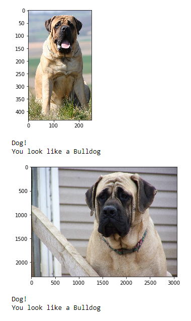

# Computer vision tasks
This repository contains code for conducting several computer vision tasks using Pytorch and OpenCV.

## [Instance segmentation](https://github.com/shanminlin/image_processing/tree/master/instance_segmentation)


## [Object detection](https://github.com/shanminlin/image_processing/tree/master/object_detection)


## [Image classification](https://github.com/shanminlin/image_processing/tree/master/image_classification)


## [Feature extraction](https://github.com/shanminlin/image_processing/tree/master/feature_extraction)
- edge detection


- contour detection


## How to run 
#### Clone the repository
```bash
git clone https://github.com/shanminlin/image_processing.git
```

Acknowledgement
1. Projects in object detection and instance segmentation were built upon Adrian' awesome PyImageSearch (https://www.pyimagesearch.com).
2. Also opencv official tutorial (https://github.com/opencv/opencv/blob/master/samples/dnn/object_detection.py)
3. Some of the projects were built upon my Udacity deep learning nanodegree projects. They have fun project to work with.
