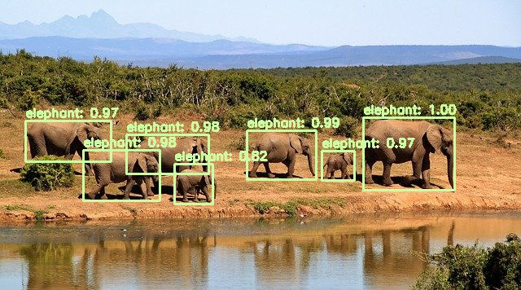
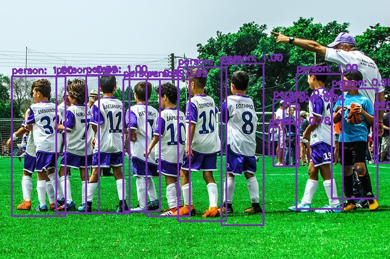
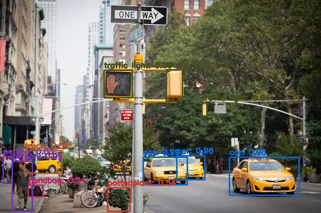
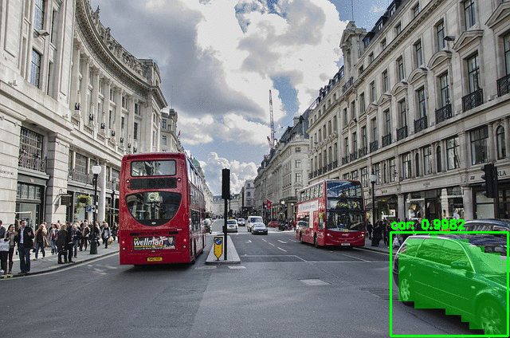
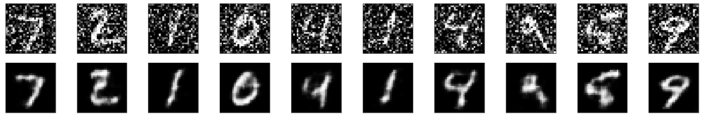
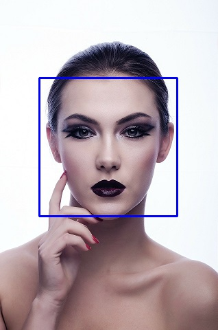
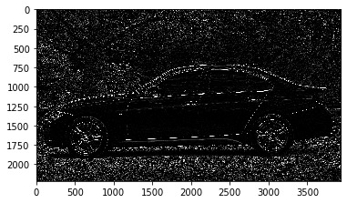
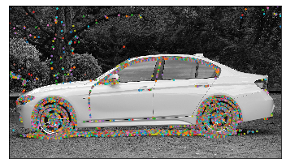

# Computer vision tasks

## Object detection

## Instance segmentation

## Image classification

## Image processing
- Gamma Correction

- Denoising

## Face detection

## Feature extraction
- edge detection

- contour detection

Acknowledgement
1. Adrian' PyImageSearch (https://www.pyimagesearch.com) helps me understand object detection and instance segmentation.
2. opencv official tutorial (https://github.com/opencv/opencv/blob/master/samples/dnn/object_detection.py)
